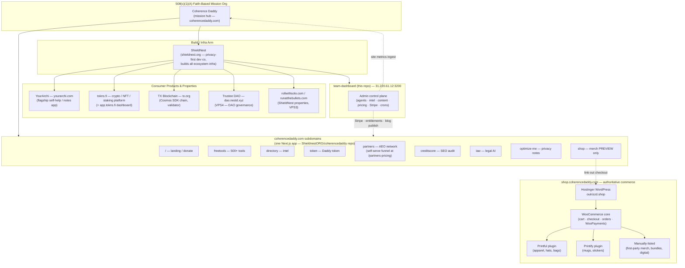
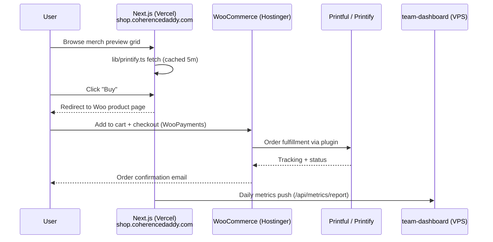

# Org Structure — Coherence Daddy Ecosystem

> Business / organizational view of the 508(c)(1)(A) ecosystem — who owns what, which repo deploys where, and how the storefronts fan out. Complements:
> - `docs/architecture/system-overview.md` — technical control-plane overview
> - `docs/guides/board-operator/org-structure.md` — agent reporting hierarchy (different "org")

---

## High-Level Org Chart

---

## Org / Ownership Matrix

| Layer | Entity | What it owns |
|---|---|---|
| **Governance** | Coherence Daddy (508(c)(1)(A)) | Mission, donations, brand, public-facing hub |
| **Build arm** | ShieldNest | All ecosystem repos, infra, VPS fleet, blockchain validator |
| **Flagship product** | YourArchi | yourarchi.com — private self-help / notes app |
| **Crypto layer** | tokns.fi + TX Blockchain | Token, staking, NFT platform, Cosmos validator |
| **Governance DAO** | Trustee DAO | On-chain ecosystem governance |
| **Public storefront (marketing)** | `ShieldnestORG/coherencedaddy` Next.js app | 9 subdomains, blog, LLM discovery, donations |
| **Authoritative commerce** | Hostinger WordPress + WooCommerce | Cart, checkout, orders, fulfillment, payments |
| **Control plane** | `ShieldnestORG/team-dashboard` (this repo) | Agents, intel, content publishing, pricing, Stripe, crons |

---

## Shop Storefront Detail

`shop.coherencedaddy.com` has **two tiers**:

1. **Preview tier (Next.js, Vercel)** — `app/shop-home/page.tsx` in the coherencedaddy repo. Uses `lib/printify.ts` to render a browse grid for SEO and marketing. No cart state, no checkout, no payment handling.
2. **Commerce tier (WordPress + WooCommerce on Hostinger)** — the actual store. Aggregates three product sources under one cart:
   - **Printful plugin** — POD fulfillment (apparel, hats, bags, embroidered items)
   - **Printify plugin** — POD fulfillment (mugs, stickers, alt catalog)
   - **Manual products** — first-party merch, digital goods, bundles

Why two tiers: the Vercel app can't host a compliant PCI/tax/shipping stack cheaply, and WooCommerce already solves the aggregation-across-POD problem via its plugin ecosystem. The Next.js preview gets SEO + brand consistency; Hostinger gets the messy commerce work.

**API key storage:** each POD plugin stores its own API key in WordPress `wp_options` (scoped per-plugin). Keys never live in any Git repo — they're set once in `wp-admin → <Provider> → Settings`.

**Categories as source tags:** products use WooCommerce categories like `Apparel - Printful`, `Drinkware - Printify`, `Coherence Daddy Originals` so the storefront can filter/section by source while keeping cart + checkout unified.

> See `coherencedaddy-landing/memory/project_shop_architecture.md` and `coherencedaddy-landing/docs/ARCHITECTURE.md#shop-storefront--hostinger-woocommerce-authoritative` for the counterpart repo-side notes.

---

## Data Flow Between Layers

---

## Future States / Open Questions

- **Domain mapping:** `shop.coherencedaddy.com` currently resolves to the Next.js preview. When WooCommerce launches, either (a) map it directly to Hostinger and move the preview to a subpath, or (b) keep preview at `shop.*` and point the "Buy" CTAs to `store.coherencedaddy.com` on Hostinger. Pending decision.
- **Order events back into team-dashboard:** no webhook exists yet. When implemented, add a WooCommerce webhook → team-dashboard ingest endpoint so order analytics flow into the control plane alongside site metrics.
- **Third POD / dropship provider:** architecture supports it — install another plugin + add a category. No cross-repo coordination required.
