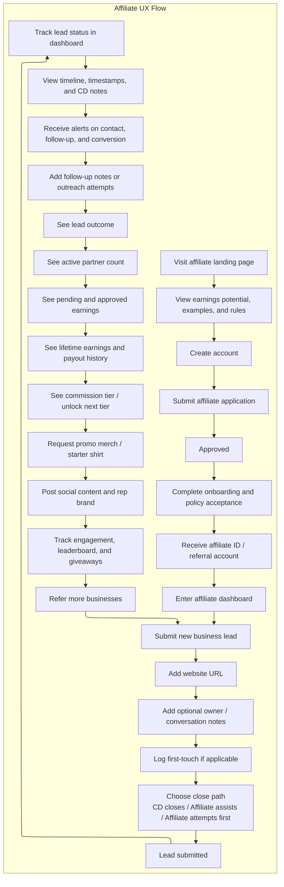
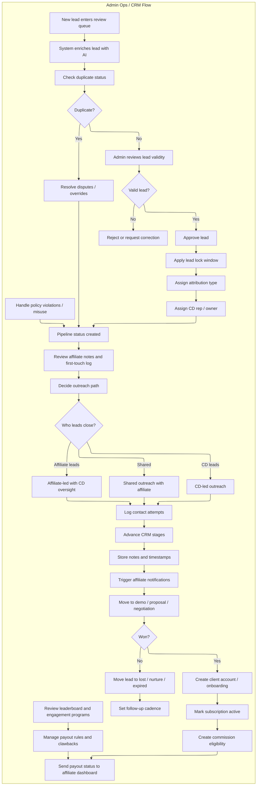
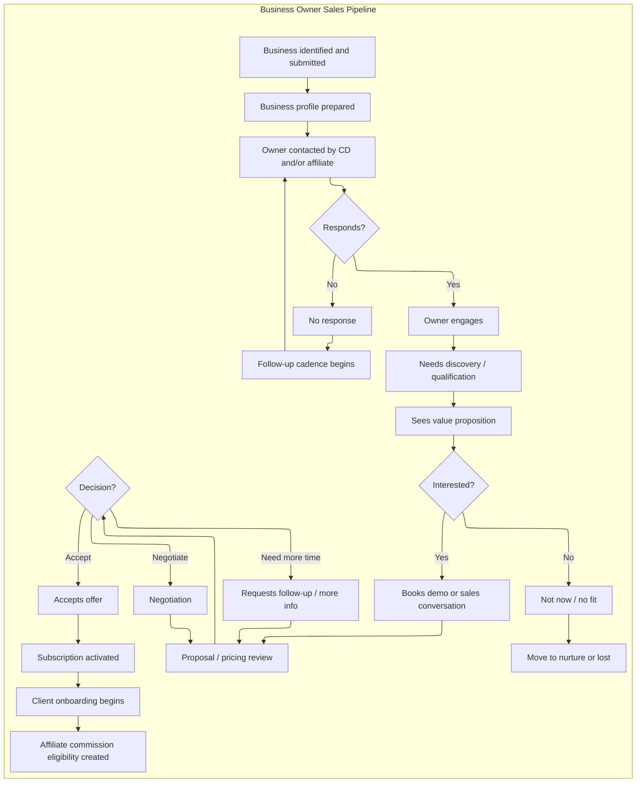

# Coherence Daddy Affiliate System — Upgraded Spec

Complete system breakdown for the upgraded affiliate program. Supersedes the narrower scope of [affiliate-user-journeys.md](affiliate-user-journeys.md) where the two overlap, and extends it with lead-lock, attribution, commissions, payouts, engagement, and compliance.

Use this for product planning, CRM logic, admin operations, affiliate UX, database design, engineering handoff, and onboarding docs.

---

## Actors and Operating Layers

**Actors**
- Affiliate
- Admin / Coherence Daddy team
- Business owner / prospect

**Operating layers**
- Acquisition and referral
- Pipeline and closing
- Commission and retention

---

## Core Product Logic Rules

Treat these as hard system rules.

### 1. Lead Lock Window

When an affiliate submits a valid lead, that lead is assigned to them for a defined ownership window.

- Lead lock starts at time of valid submission
- Default lock window: **30 days**
- During this time, the affiliate is the primary referring partner on record
- Another affiliate cannot claim the same lead unless:
  - first submission is invalid
  - first lead expires
  - admin overrides ownership

**Why:** Prevents affiliate disputes and gives the submitter confidence.

### 2. First-Touch Log

Captured at submission time if the affiliate already spoke with the owner.

Fields:
- `first_touch_status` — yes / no
- `first_touch_type` — in-person / call / text / email / social DM
- `first_touch_date`
- `first_touch_notes`
- `relationship_warmth` — strong / medium / weak

**Why:** Warm leads are handled differently than cold referrals.

### 3. CD-First Recommendation

Avoids messy outreach overlap.

- Cold lead → affiliate is advised to wait **5 business days**
- Warm lead or first-touch logged → affiliate may assist immediately
- If affiliate chose "attempt first," CD is notified and outreach logic changes accordingly

### 4. Shared-Close Attribution

- Original valid affiliate submission keeps referral attribution
- CD team may still own sales execution
- If affiliate directly contributes to closing, mark lead as **affiliate-assisted close**

Attribution types:
- `affiliate_referred_cd_closed`
- `affiliate_assisted_cd_closed`
- `affiliate_led_cd_finalized`
- `cd_direct`
- `admin_override`

### 5. Duplicate Policy

- First **valid qualified submission** wins
- Validation requires: real business, usable website or identifying info, not already active client, not locked by another affiliate
- Admin may override when: fake/junk first submission, affiliate cannot prove legitimacy, or business was already in direct CD pipeline before submission

### 6. Misrepresentation Rule

Affiliates may not promise: custom pricing, discounts, guaranteed outcomes, onboarding timelines, unoffered platform features, exclusive territory, or contract terms.

System behavior: onboarding policy acceptance, repeat violations cause warnings / suspension / removal, admin can flag risky notes or outreach.

---

## Status Architecture

### Lead Statuses
Draft · Submitted · Enriched · Duplicate Review · Qualified · Rejected · Locked · Assigned · Contacted · Awaiting Response · Interested · Demo Scheduled · Proposal Sent · Negotiation · Won · Lost · Nurture · Expired

### Attribution Statuses
Unassigned · Affiliate Referred · Affiliate Assisted · Affiliate Led · CD Sourced · Admin Override

### Commission Statuses
Not Eligible · Pending Activation · Pending Approval · Approved · Scheduled for Payout · Paid · Held · Reversed · Clawed Back

---

## Chart 1 — Affiliate UX Flow

---

## Chart 2 — Admin Ops / CRM Flow

---

## Chart 3 — Business Owner Sales Pipeline

---

## Product-System Map

### Pages / Screens

**Public**
- Affiliate landing page
- Earnings explainer page
- FAQ / program rules
- Application page
- Brand rep / promo program page

**Affiliate app**
- Dashboard home
- New lead submission
- Lead details page
- My pipeline
- Alerts / notifications
- Earnings
- Payout history
- Commission tiers
- Promo leaderboard
- Brand assets / social kit
- Settings / payout method
- Policy and training center

**Admin**
- Admin dashboard
- Lead review queue
- Duplicate resolution center
- CRM pipeline board
- Lead detail page
- Attribution manager
- Affiliate directory
- Commission approval panel
- Payout management
- Policy violation panel
- Leaderboard / engagement management
- Notification rules / automations
- Settings / thresholds / rules

**Business owner**

Minimum internal states: contacted · interested · demo booked · proposal sent · won · onboarding · active client.

Optional future external pages: booking page · proposal acceptance page · onboarding intake page · subscription confirmation page.

### Data Objects

**Affiliate**
`affiliate_id` · `name` · `email` · `status` · `application_status` · `onboarding_complete` · `policy_accepted_at` · `affiliate_tier` · `payout_method` · `payout_email_or_account` · `total_leads` · `total_conversions` · `lifetime_earnings` · `active_partner_count` · `promo_opt_in` · `violation_count`

**Business / Lead**
`lead_id` · `business_name` · `website` · `industry` · `location` · `contact_name` · `contact_email` · `contact_phone` · `lead_status` · `source_type` · `fit_score` · `priority_score` · `readiness_score` · `duplicate_status` · `assigned_rep` · `current_owner_type` · `created_at` · `updated_at`

**Referral Attribution**
`attribution_id` · `lead_id` · `affiliate_id` · `attribution_type` · `lock_start_at` · `lock_expires_at` · `first_touch_logged` · `first_touch_type` · `first_touch_date` · `relationship_warmth` · `affiliate_close_preference` · `admin_override` · `override_reason`

**CRM Activity**
`activity_id` · `lead_id` · `actor_type` · `actor_id` · `activity_type` · `note` · `timestamp` · `visible_to_affiliate` · `visible_internal_only`

**Deal / Opportunity**
`opportunity_id` · `lead_id` · `pipeline_stage` · `proposal_status` · `outcome` · `closed_at` · `close_type` · `assigned_sales_owner`

**Subscription / Client**
`client_id` · `lead_id` · `business_owner_status` · `subscription_status` · `activated_at` · `canceled_at` · `refund_status`

**Commission**
`commission_id` · `affiliate_id` · `lead_id` · `client_id` · `commission_type` · `commission_rate` · `period_start` · `period_end` · `amount` · `status` · `payout_batch_id` · `clawback_reason`

**Payout**
`payout_id` · `affiliate_id` · `amount` · `payout_status` · `payout_method` · `payout_date` · `batch_month`

**Promo / Engagement**
`engagement_id` · `affiliate_id` · `campaign_id` · `post_url` · `hashtag_used` · `score` · `giveaway_eligible`

### Permissions

**Affiliates can:** create and submit leads · log first-touch · add notes · see their own leads · see visible pipeline stages · see visible CD notes · see earnings and payout data · update payout settings · opt into promo program.

**Affiliates cannot:** change attribution after submission · reassign leads · alter admin-only statuses · edit pricing or offer terms · override duplicates · approve commissions · change payout rules.

**Admins can:** approve / reject leads · resolve duplicates · override attribution · manage lock windows · assign reps · update pipeline stages · log internal notes · log affiliate-facing notes · approve / reverse commissions · manage payouts · enforce policy violations · manage tiers and promo programs.

**Business owners (if portal exists) can:** book demos · complete onboarding forms · approve subscription or proposal · submit required onboarding info.

### Automations

**Lead:** AI enrichment · duplicate detection · fit / priority scoring · lock window assignment · CRM owner assignment · first affiliate notification after review.

**Outreach:** notify CD rep on warm lead · notify affiliate on contact, demo, status change · recommend follow-up tasks based on inactivity.

**Commission:** create pending commission on subscription activation · pending → approved after hold window · refund / clawback rules on cancellation · schedule payout on cycle · roll forward below-threshold balances.

**Engagement:** notify affiliate near next tier · monthly leaderboard refresh · giveaway eligibility check · promo reward notifications · inactive affiliate re-engagement.

**Compliance:** flag suspicious claims in notes · warn after policy issues · suspend after admin review.

### Notifications

**Affiliate:** application approved · onboarding incomplete reminder · lead received / qualified / rejected · duplicate under review · lead contacted · follow-up needed · demo scheduled · proposal sent · lead won / lost · commission created / approved · payout sent / held · next tier unlocked · giveaway eligible.

**Admin:** new lead submitted · duplicate conflict · affiliate-led close flagged · warm lead submitted · inactive lead needing review · commission dispute · payout issue · policy violation flag.

**Business owner:** meeting confirmation · onboarding invite · subscription confirmation · follow-up reminder · proposal review reminder.

### Payout States and Logic

Exposed concepts: when commission starts · recurring vs one-time · payout schedule · minimum threshold · payout method · hold period · refund window · clawback policy · total active clients · lifetime earnings · pending earnings · approved earnings · paid earnings.

**Lifecycle**
1. Client subscription activates → commission created as **Pending Activation**
2. After hold / refund protection → **Approved**
3. On payout cycle date → **Scheduled for Payout**
4. Payout sent → **Paid**
5. Cancellation / refund inside rules → **Reversed** or **Clawed Back**

**Example business rules**
- Payout cycle: monthly
- Minimum threshold: configurable
- Refund protection: first 30 days
- Recurring commissions: monthly while account active
- One-time commissions: paid only on first qualifying payment
- Clawback: only inside defined refund or fraud window

### Lead Attribution Rules

Each lead has exactly one owner, one attribution type, one lock window.

**Decision rules**
1. First valid qualified submission wins
2. Lead lock applies immediately on approval or automated validation
3. First-touch log strengthens affiliate claim
4. Warm lead justifies affiliate-assisted early outreach
5. CD-first recommendation applies to cold leads unless affiliate chose attempt-first
6. Shared-close preserves affiliate commission when their referral remains valid
7. Admin can override only with recorded reason

**Conflict examples**
- A submits Monday, B submits same business Wednesday → A keeps ownership if valid.
- A submits with no usable data, B submits complete with documented first-touch → admin may override.
- Affiliate submits, CD closes, affiliate never speaks again → affiliate still credited if referral valid.
- Affiliate submits, warm, helps book, CD finalizes → `affiliate_assisted_cd_closed`.

### Affiliate-Facing Rules Copy

**Lead Ownership.** When you submit a valid new business lead, that lead is reserved under your account for a limited ownership period. If the business signs during that period and your referral remains valid, you receive credit according to program rules.

**Warm Introductions.** If you already know the owner or have spoken with them, log that in the lead form. Warm referrals often move faster and help us coordinate the best outreach plan.

**Closing Support.** You may help introduce, follow up with, or support a deal, but you may not promise pricing, discounts, guarantees, or custom terms unless approved by Coherence Daddy.

**Shared Credit.** Many deals close through a combination of your relationship and our sales process. If your referral is valid and tracked correctly, your credit remains protected.

**Duplicate Leads.** The first valid qualified lead submission usually receives ownership. Duplicate and edge cases are reviewed by admin.

### Recommended Build Order

**Phase 1** — affiliate signup · lead submission · AI enrichment · duplicate detection · basic admin review · CRM pipeline statuses · affiliate dashboard visibility · manual commission entry · basic payout tracking.

**Phase 2** — first-touch logging · attribution rules engine · notifications · payout approval states · threshold logic · hold periods · commission automation.

**Phase 3** — promo / merch loop · leaderboard · tier upgrades · giveaway tracking · compliance warnings · affiliate engagement automations.

**Phase 4** — business owner self-serve intake · better analytics · attribution dispute console · advanced reporting · SLA logic for outreach windows.

---

## System Summary

A complete version of this affiliate system should:

- let affiliates join with clarity
- let them submit leads with context
- protect their referrals with lock and attribution rules
- enrich and qualify businesses automatically
- let admins manage real CRM flow
- give affiliates visibility during the close process
- support both CD-led and affiliate-assisted deals
- clearly define when commissions start and how they pay out
- prevent duplicate disputes
- prevent affiliates from freelancing promises
- create a retention loop through merch, tiers, leaderboards, and giveaways

This turns the program from a simple "refer and hope" model into a real **partner revenue system**.
