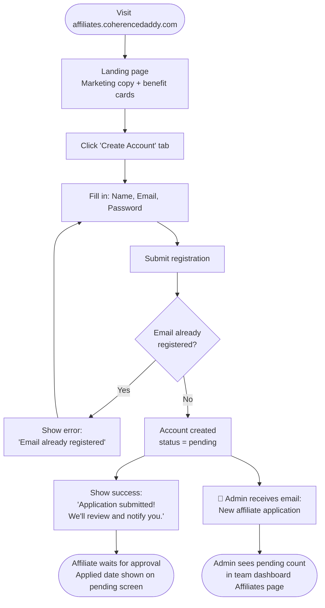
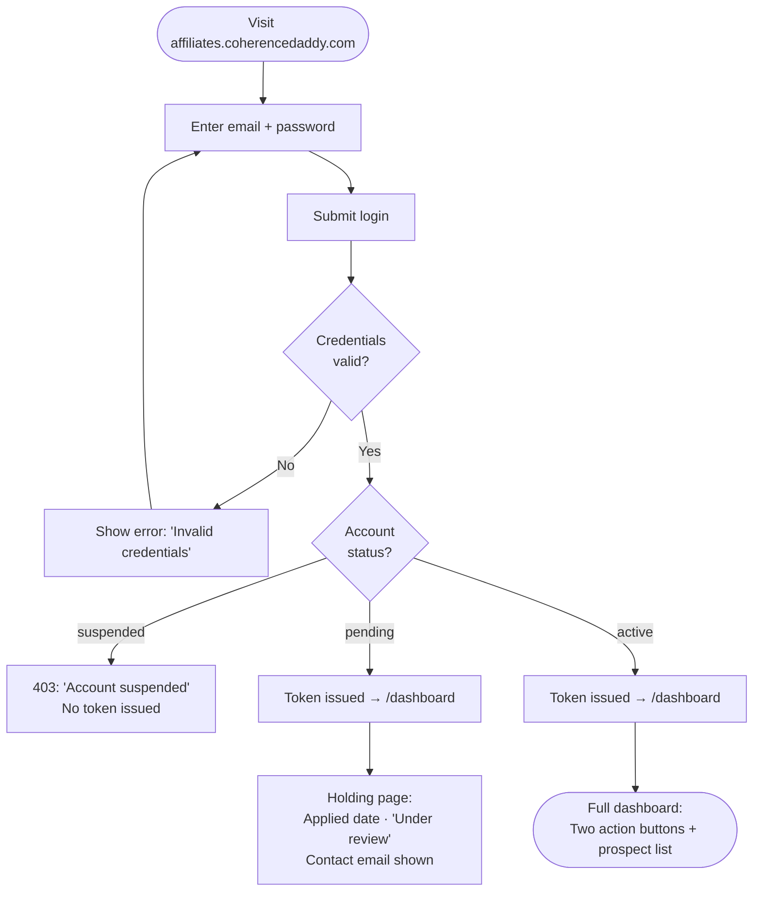
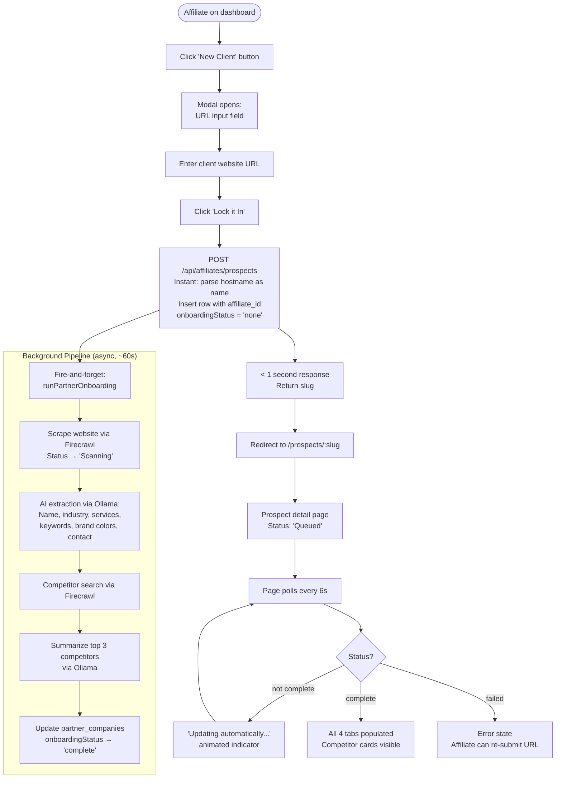
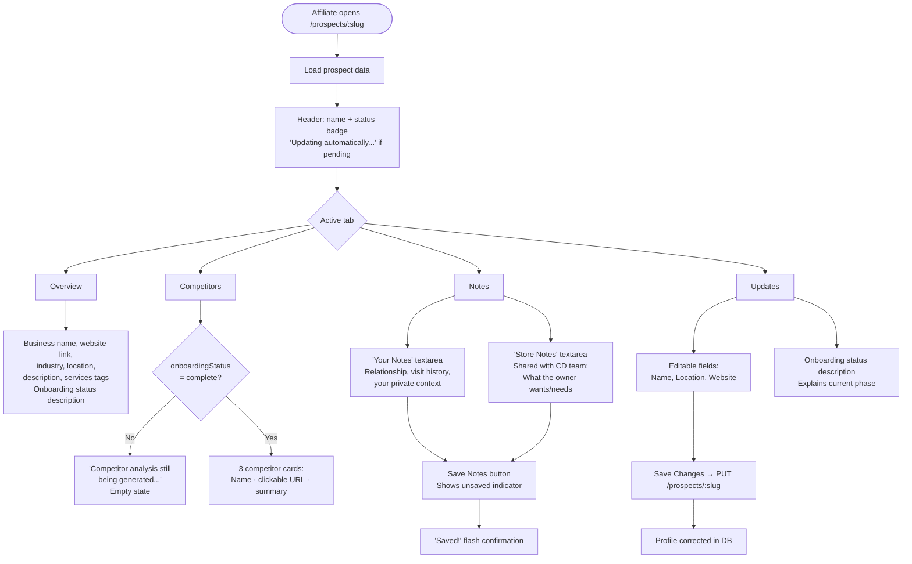
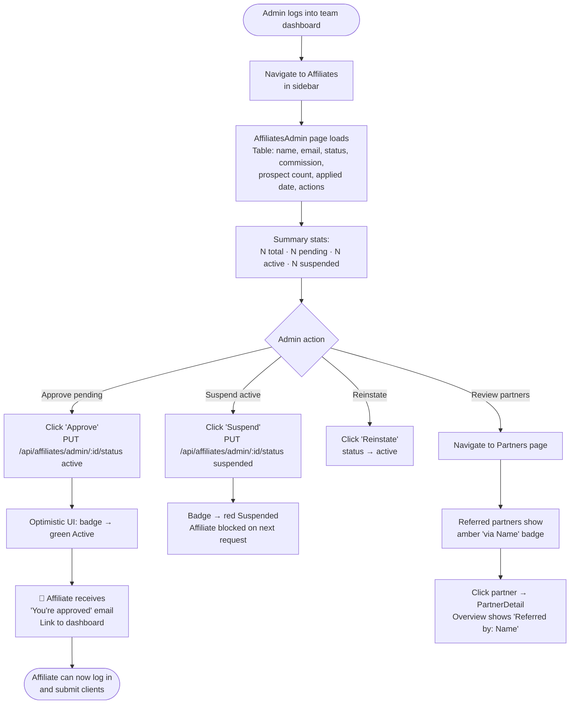
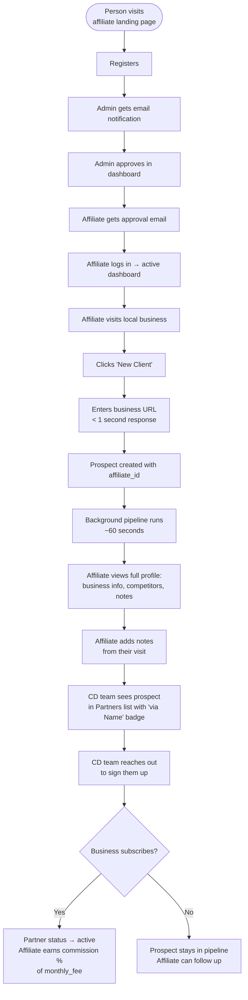

# Affiliate System — User Journey Flows

Eight journeys covering the full affiliate lifecycle: registration, login, password recovery, new client submission, prospect management, admin oversight, and email notification touchpoints.

---

## 1. Affiliate Registration

A new person discovers the program and applies.



---

## 2. Affiliate Login & Status Routing

Returning affiliate authenticates and is routed by account status.



---

## 3. Password Recovery

Affiliate who forgot their password self-recovers without admin intervention.

```mermaid
flowchart TD
    A([Affiliate on login page]) --> B[Click 'Forgot password?']
    B --> C[/reset-password page\nEmail input form]
    C --> D[Enter email + submit]
    D --> E[Always shows:\n'Check your email'\nwhether email exists or not]
    E --> F{Email found\nin DB?}
    F -- No --> G[No action — silent]
    F -- Yes --> H[Generate raw token\nStore SHA-256 hash\n1-hour expiry]
    H --> I[📧 Send reset email\nwith link: /reset-password?token=...]
    I --> J[Affiliate clicks link]
    J --> K[/reset-password?token=...\nNew password form]
    K --> L[Enter + confirm password\nmin 8 chars]
    L --> M{Token valid\n& not expired?}
    M -- No --> N[Error: 'Invalid or\nexpired reset link']
    M -- Yes --> O[Password updated\nToken nulled out]
    O --> P[Show: 'Password updated'\nBack to login link]
    P --> Q([Affiliate logs in\nwith new password])
```

---

## 4. New Client Submission

Active affiliate submits a local business — returns in under 1 second, pipeline runs in the background.



---

## 5. Prospect Detail — Affiliate Perspective

How an affiliate explores and enriches a submitted prospect over time.



---

## 6. Admin — Affiliate Management

How the Coherence Daddy team reviews, approves, and manages affiliates.



---

## 7. Email Notification Touchpoints

All automated emails in the affiliate system.

```mermaid
flowchart LR
    subgraph Affiliate["Affiliate receives"]
        E1[✉ affiliate-approved\n'You're in — welcome'\nLink to dashboard]
        E2[✉ affiliate-reset-password\n'Reset your password'\n1-hour link]
    end

    subgraph Admin["Admin receives"]
        E3[✉ affiliate-application\n'New application from [Name]'\nLink to /affiliates page]
    end

    subgraph Triggers["What triggers each"]
        T1[POST /register] --> E3
        T2[PUT /admin/:id/status → active] --> E1
        T3[POST /forgot-password\nwhen email found] --> E2
    end

    style Affiliate fill:#f0fdf4,stroke:#86efac
    style Admin fill:#eff6ff,stroke:#93c5fd
    style Triggers fill:#fefce8,stroke:#fde047
```

---

## 8. Full Lifecycle Summary

End-to-end from discovery to active affiliate generating real leads.



---

## Summary Table

| Journey | Entry Point | Key Outcome | What's Automated |
|---------|-------------|-------------|-----------------|
| Registration | Landing → Create Account | Account pending | Admin notified by email |
| Login | Landing → Log In | Routed by status | Holding page for pending |
| Password Recovery | Login → Forgot password | Self-service reset | Reset email with 1hr token |
| New Client | Dashboard → New Client | Prospect created < 1s | Full AI pipeline in background |
| Prospect Detail | `/prospects/:slug` | Enriched profile | 6s polling until complete |
| Admin Management | Dashboard → Affiliates | Approve/suspend | Approval email to affiliate |
| Email Touchpoints | System events | Timely notifications | 3 templates fully wired |
| Full Lifecycle | Discovery → Commission | Revenue for both sides | Entire pipeline automated |
