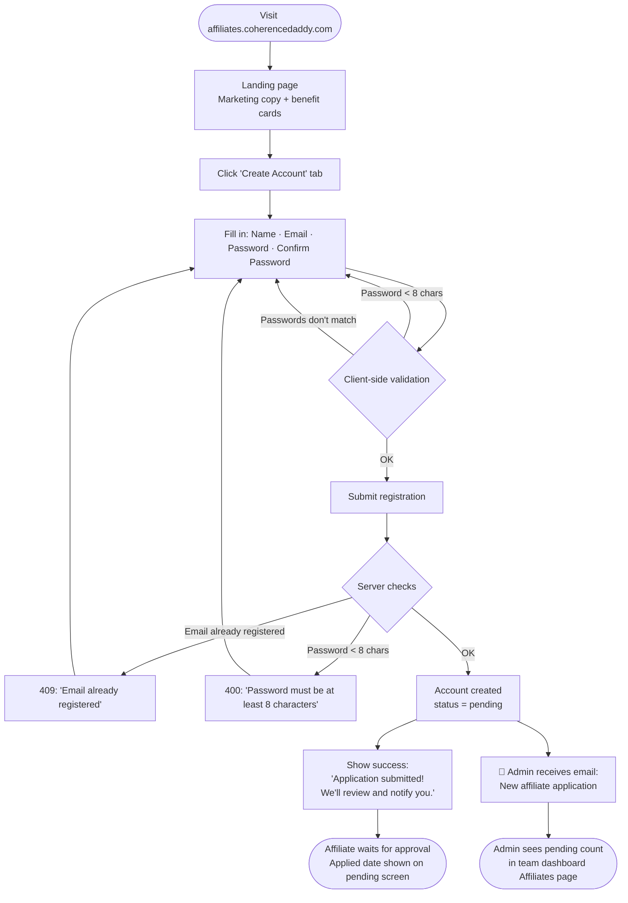
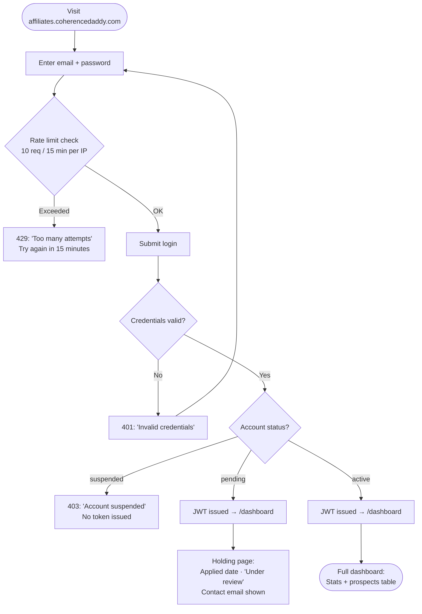
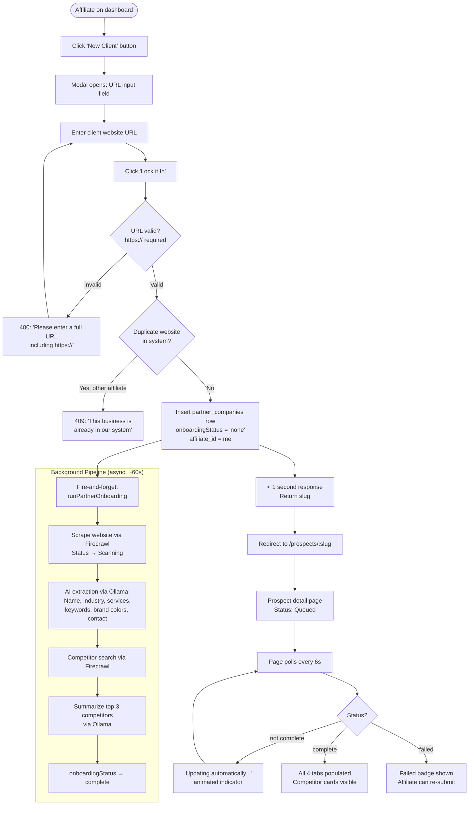
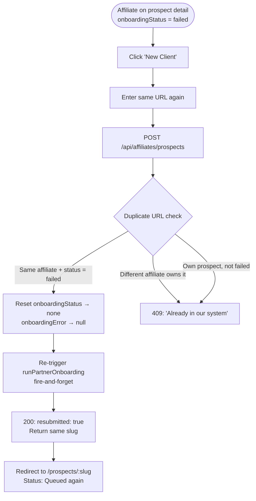
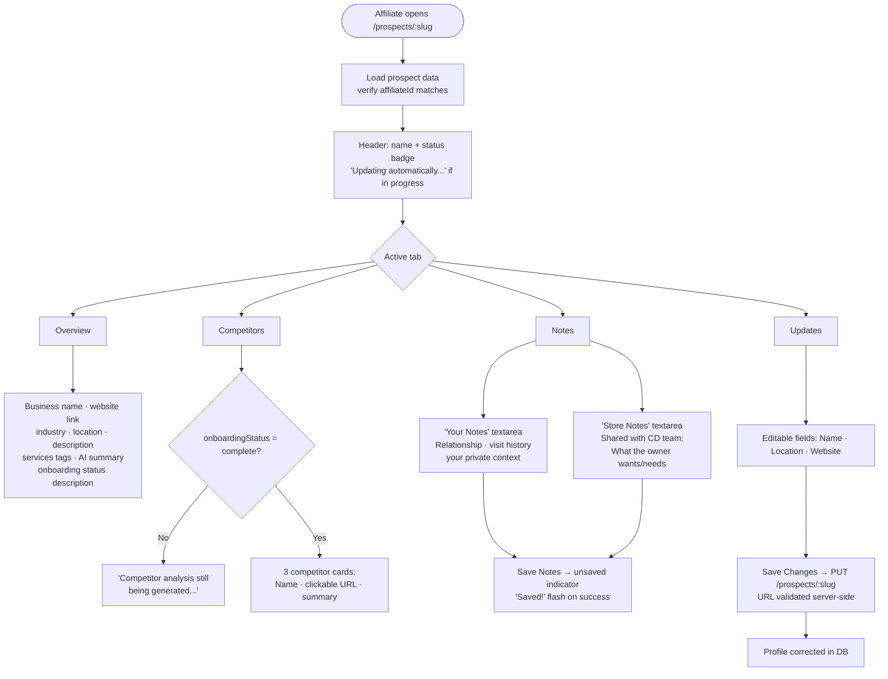
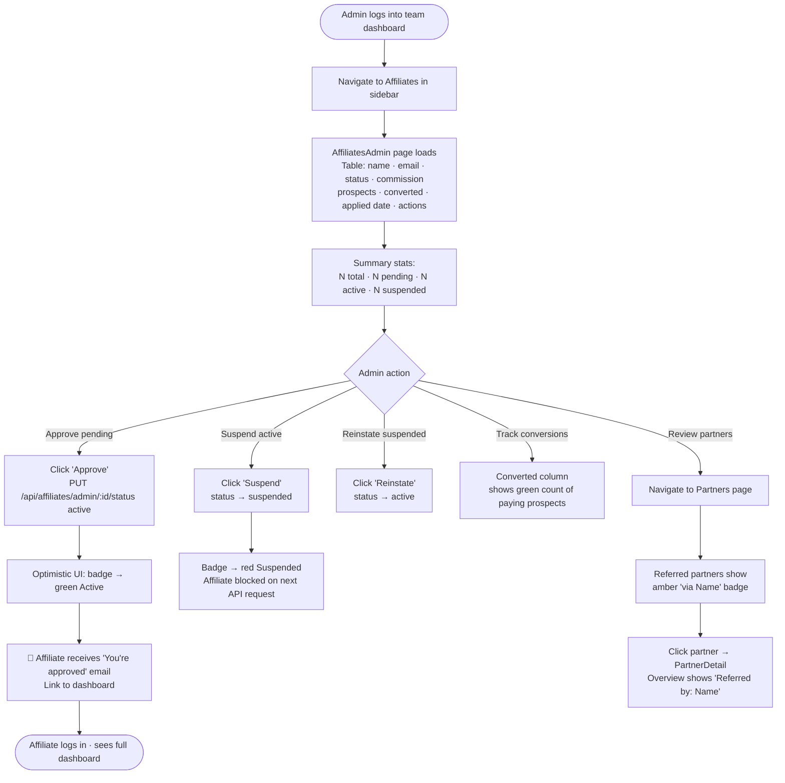
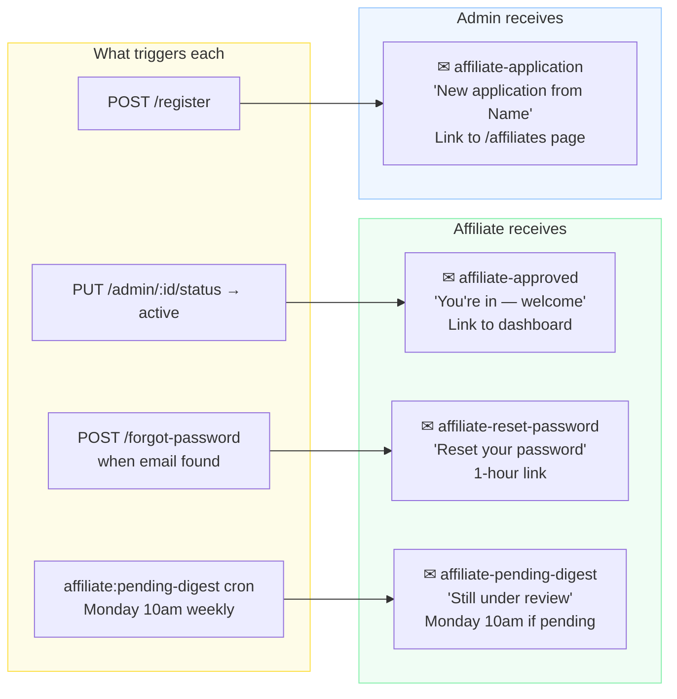
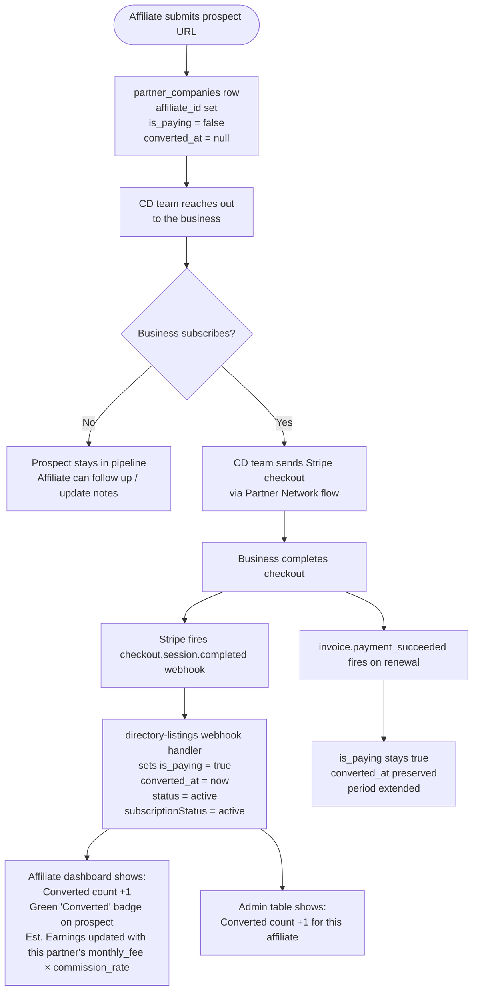
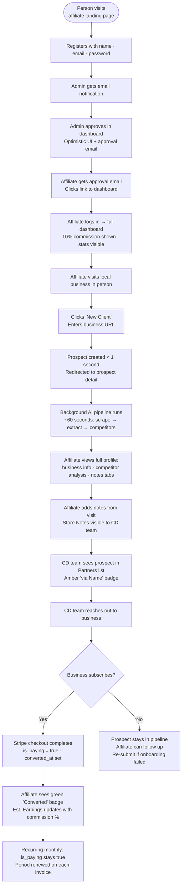

# Affiliate System — User Journey Flows

Ten journeys covering the full affiliate lifecycle: registration, login, password recovery, new client submission, failed re-submission, prospect management, admin oversight, email touchpoints, commission conversion, and the full end-to-end lifecycle.

---

## 1. Affiliate Registration

A new person discovers the program and applies.



---

## 2. Affiliate Login & Status Routing

Returning affiliate authenticates and is routed by account status.



**Token:** HS256 JWT, 30-day TTL, signed with `AFFILIATE_JWT_SECRET`. Every authenticated request re-validates account status from DB — suspended affiliates are blocked instantly even with a valid token.

---

## 3. Password Recovery

Affiliate who forgot their password self-recovers without admin intervention.

```mermaid
flowchart TD
    A([Affiliate on login page]) --> B[Click 'Forgot password?']
    B --> C[/reset-password page\nEmail input form]
    C --> D[Enter email + submit]
    D --> E[Always shows:\n'Check your email'\nwhether email exists or not]
    E --> F{Email found in DB?}
    F -- No --> G[No action — silent]
    F -- Yes --> H[Generate raw token\nStore SHA-256 hash\n1-hour expiry]
    H --> I[📧 Send reset email\nwith link: /reset-password?token=...]
    I --> J[Affiliate clicks link]
    J --> K[/reset-password?token=...\nNew password form]
    K --> L[Enter + confirm password\nmin 8 chars]
    L --> M{Token valid & not expired?}
    M -- No --> N[400: 'Invalid or expired reset link']
    M -- Yes --> O[Password updated\nToken nulled out]
    O --> P[Show: 'Password updated'\nBack to login link]
    P --> Q([Affiliate logs in with new password])
```

---

## 4. New Client Submission

Active affiliate submits a local business — returns in under 1 second, AI pipeline runs in background.



---

## 5. Failed Prospect Re-submission

When onboarding fails (Firecrawl timeout, Ollama error, etc.), the affiliate can retry without getting a duplicate-URL block.



---

## 6. Prospect Detail — Affiliate Perspective

How an affiliate explores and enriches a submitted prospect.



---

## 7. Admin — Affiliate Management

How the Coherence Daddy team reviews, approves, and manages affiliates.



---

## 8. Email Notification Touchpoints

All automated emails in the affiliate system.



**Rate limits on auth endpoints:** 10 requests per IP per 15-minute window (shared across register, login, forgot-password). Returns 429 when exceeded.

---

## 9. Commission Conversion Tracking

How a prospect moves from submitted lead to confirmed paying partner.



---

## 10. Full Lifecycle Summary

End-to-end from discovery to active affiliate generating real revenue.



---

## Summary Table

| Journey | Entry Point | Key Outcome | What's Automated |
|---------|-------------|-------------|-----------------|
| Registration | Landing → Create Account | Account pending | Admin notified; confirm password + 8-char min enforced |
| Login | Landing → Log In | JWT issued, routed by status | Rate limiting; DB status check per request |
| Password Recovery | Login → Forgot password | Self-service reset | Reset email; SHA-256 token; 1hr expiry |
| New Client | Dashboard → New Client | Prospect created < 1s | Full AI pipeline in background |
| Failed Re-submission | Dashboard → New Client (same URL) | Onboarding re-triggered | Reset status, re-run pipeline |
| Prospect Detail | `/prospects/:slug` | Enriched profile | 6s polling until complete |
| Admin Management | Dashboard → Affiliates | Approve/suspend/track | Approval email; converted count column |
| Email Touchpoints | System events | Timely notifications | 4 templates; Monday pending digest cron |
| Conversion Tracking | Stripe webhook | `is_paying` flag set | `converted_at` stamped; earnings recalculated |
| Full Lifecycle | Discovery → Revenue | Both sides earn | Entire pipeline automated end-to-end |
